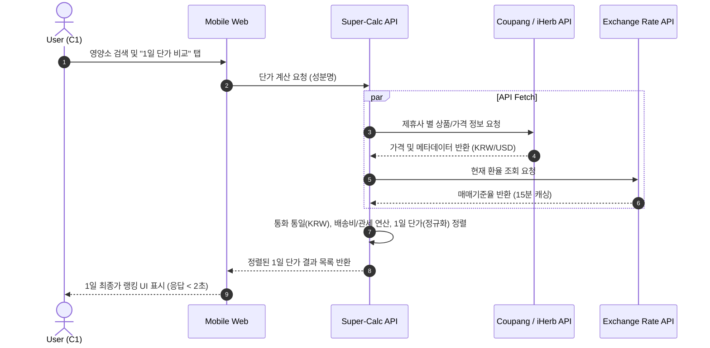
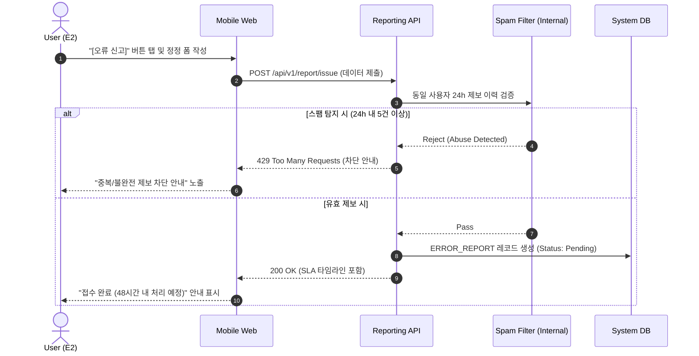

# Software Requirements Specification (SRS)
Document ID: SRS-001
Revision: 1.0
Date: 2026-04-15
Standard: ISO/IEC/IEEE 29148:2018

---

## 1. Introduction

### 1.1 Purpose
본 Software Requirements Specification(SRS)의 목적은 "건기식 성분·가격 비교 초자동화 플랫폼"의 기능적, 비기능적 요구사항을 정의하는 것이다. 본 플랫폼은 공급 과잉 및 정보 혼돈 상태에 있는 건강기능식품 시장에서 소비자의 '비교 및 해석 능력' 부재를 해결하기 위해 설계되었다. 궁극적으로 수동 엑셀 계산과 광고성 콘텐츠 필터링에 지친 사용자들에게 실시간 1일 단가 계산 및 의학 팩트체크를 제공하는 신뢰 가능한 플랫폼을 구축하는 것을 목적으로 한다.

### 1.2 Scope (In-Scope / Out-of-Scope)
본 문서는 Phase 1(MVP) 구현을 위한 요구사항을 명시한다.

**In-Scope (범위 내):**
* **F1. 실시간 1일 단가 정규화 엔진:** iHerb, 쿠팡, 네이버 3개 채널 기반 API 파싱, 실시간 환율 적용, 1일 복용량 기준 원화(KRW) 최종 단가 환산 및 랭킹 제공.
* **F2. 의학 팩트체크 대시보드 (Anti-BS):** 마케팅 노이즈(배너, 유저 리뷰) 전면 차단, 식약처 건강기능식품공전 기반 등급 뱃지 시스템 구현, 전문 용어의 일상어 번역.
* **F3. 1-Tap 팩트 요약 카카오톡 공유:** 결과 요약 카드(Open Graph) 동적 생성, 앱 설치 없는 웹뷰 기반 카카오톡 공유 및 딥링크 결제 전환.
* **F4. 데이터 무결성 시스템:** 원본 라벨 이미지 및 데이터 출처(식약처 DB, 논문) 제공, 사용자 오류 제보 기능 및 48시간 내 수정 SLA 보장.
* **목표 지표 달성:** 플랫폼 내 결제/공유 완료까지의 소요 시간(TTC) <= 5분 달성, 단가 계산 소요 시간 <= 5초 달성.

**Out-of-Scope (범위 외 - 명시적 배제):**
* **F5. 유저 자율 리뷰/별점 게시판:** 광고 침투 위험에 따른 신뢰도 훼손 방지를 위해 배제.
* **F6. AI 문진 기반 개인화 추천:** 초기 데이터 편향 위험 및 복잡성 증가로 배제.
* 네이티브 모바일 애플리케이션 (MVP는 반응형 모바일 웹 퍼스트로 진행).
* 브랜드 스폰서 광고 및 배너 노출.
* 전체 시장 SKU(수만 개) 지원 (MVP는 상위 300~500개 제품으로 한정).

### 1.3 Definitions, Acronyms, Abbreviations
* **JTBD (Jobs to be Done):** 사용자가 특정 상황에서 완수하고자 하는 근본적인 과업.
* **AOS (Adjusted Opportunity Score):** 기회 점수 조정값. 중요도 x (1 - 만족도/5)로 계산됨.
* **DOS (Discovered Opportunity Score):** 발견된 기회 점수. AOS x 시장 관련성으로 계산됨.
* **TTC (Time-To-Completion):** 사용자가 탐색을 시작한 후 결제 링크를 클릭하거나 SNS 공유를 완료하기까지의 총 소요 시간.
* **Anti-BS (Anti-Bullshit):** 광고성 콘텐츠, 뒷광고, 비과학적 주장을 배제하는 플랫폼의 핵심 포지셔닝.
* **K-Factor:** 바이럴 계수 (기존 사용자 1명이 유입시키는 신규 사용자 수).
* **MFDS:** 식품의약품안전처 (Ministry of Food and Drug Safety).

### 1.4 References
* **REF-01:** 한국건강기능식품협회 (2023) 건기식 구매 전 온라인 탐색 비율 보고서.
* **REF-02:** 한국소비자원 (2022) 시장 조사 - 동일 성분 기준 가격 차이 분석.
* **REF-03:** 식약처 소비자 인식조사 (2021) - 가격-품질 오인율 및 성분 비교 난이도.
* **REF-04:** 공정거래위원회 (2023) 온라인 광고 실태조사.
* **REF-05:** 내부 리서치 (2026) - Value Proposition Sheet V2 (fin), AOS-DOS 매트릭스, JTBD 인터뷰 리포트.

### 1.5 Constraints & Assumptions
* **제약사항 (Constraints):**
    * 법률적 제약: 서비스 내 모든 성분 및 효능 표기는 건강기능식품법을 준수해야 하며, 질병 예방 및 치료 표현은 절대 금지된다 (위반 시 Critical Risk).
    * 비용 제약: MVP의 월 인프라 운영 비용은 200만 원(KRW) 이하를 유지해야 한다.
    * 기술적 제약: 무단 웹 크롤링은 엄격히 금지되며, 반드시 공식 Affiliate API(iHerb, 쿠팡) 또는 공공 API(식약처)만을 사용하여 데이터를 수집해야 한다.
* **가정 (Assumptions):**
    * iHerb 및 쿠팡 파트너스 API는 제품 성분 메타데이터 및 가격 정보를 제공한다.
    * 카카오 Link API의 정책이 최소 6개월 이상 현행(외부 딥링크 허용)을 유지한다.
    * 한국수출입은행 환율 API가 15분 주기로 안정적인 갱신 데이터를 제공한다.

---

## 2. Stakeholders

| Stakeholder | 역할 (Role) | 책임 (Responsibility) | 주요 관심사 (Interest) |
|---|---|---|---|
| **C1 (가성비 최적화자)** | Core User | 단가/가성비 데이터 소비, 실구매 전환 | 채널 간 1일 단가 즉시 산출, 수동 계산 과부하 해소, 최종 지불가(배송비/관세 포함) 정확도 |
| **C2 (건강 계기 진입자)** | Core User | 정보 탐색, 팩트 기반 구매 결정 | 복잡한 성분 정보의 쉬운 해석, 광고/협찬 콘텐츠가 배제된 깨끗하고 신뢰성 높은 정보 도출 |
| **A2 (트렌드 탐색/공유자)** | Adjacent User | SEO 유입, 결과 공유(바이럴) | 특정 성분에 대한 빠른 팩트체크, 외부 앱 설치 없이 즉시 작동하는 원클릭 공유 UI |
| **E2 (데이터 분석가 성향)** | Extreme User | 오류 신고, 데이터 무결성 검증 | 데이터 원본(식약처 라벨, 논문) 접근성, 오류 제보 시 신속한 수정(48시간 SLA) 및 투명한 반영 여부 |

---

## 3. System Context and Interfaces

### 3.1 External Systems
* **iHerb Affiliate System:** 제품 카탈로그, 성분표, 가격(USD), 딥링크 생성 기능을 제공하는 RESTful API 연동.
* **Coupang Partners System:** 제품 검색, 가격(KRW), 제품 메타데이터, 딥링크 생성 기능을 제공하는 RESTful API 연동.
* **식약처 공공 데이터 포털:** 건강기능식품공전, 기능성 인정 내용, 일일 섭취량 정보를 제공하는 외부 공공 API 연동.
* **환율 제공 시스템 (한국수출입은행 등):** 실시간 통화별 매매기준율 환율 제공 API 연동.
* **Kakao Link System:** Open Graph 정보 기반의 카카오톡 메시지 발송을 처리하는 JS SDK 연동.

### 3.2 Client Applications
* **Mobile Web App:** MVP 주력 인터페이스. 반응형 웹 기술을 적용하여 iOS/Android 모바일 브라우저 환경에서 동작하며, 앱 설치 없는 경험을 제공한다.

### 3.3 API Overview
플랫폼은 데이터 취합과 제공을 분리한 API 구조를 갖는다.
* **External APIs:** 외부 커머스(iHerb, Cou팡) 통신, 식약처 데이터 조회, 환율 갱신 수행.
* **Internal APIs:**
    * `Super-Calc API`: 제품의 멀티 채널 데이터를 수집하여 1일 단가 정규화 및 정렬된 결과 반환.
    * `Badge API`: `ingredient_id` 기반 식약처 공전 등급 뱃지 결과 반환.
    * `Reporting API`: 오류 제보 접수 처리.

### 3.4 Interaction Sequences

---

## 4. Specific Requirements

### 4.1 Functional Requirements

| ID | 우선순위 (MoSCoW) | 요구사항 명 (Source) | Acceptance Criteria (Given/When/Then) |
|---|---|---|---|
| **REQ-FUNC-101** | Must | 단가 정규화 산출 (Story 1) | **Given** 사용자가 특정 영양소를 검색한 상태에서, **When** 단가 비교를 요청하면, **Then** 다채널 제품의 1일 복용 기준 원화 단가가 정렬되어 표시되어야 한다. |
| **REQ-FUNC-102** | Must | 실시간 환율 적용 (Story 1) | **Given** 외화(USD)와 원화(KRW) 제품이 섞여 있을 때, **When** 결과가 표시되면, **Then** 적용된 실시간 환율과 갱신 시각이 UI에 명시되어야 한다. |
| **REQ-FUNC-103** | Must | 최종 실지불가 제공 (Story 1) | **Given** 배송비 및 관세 부과 대상 제품이 있을 때, **When** 단가 랭킹이 로드되면, **Then** 모든 추가 비용이 포함된 '실지불가'가 계산되어 정확히 노출되어야 한다. |
| **REQ-FUNC-104** | Must | 채널 API 장애 폴백 (Story 1) | **Given** 3개 채널 중 일부 API가 타임아웃/오류를 반환할 때, **When** 비교를 요청하면, **Then** 전체 결과를 차단하지 않고 정상 채널 결과만 반환하며, 오류 채널은 안내 메시지를 인라인으로 노출해야 한다. |
| **REQ-FUNC-105** | Must | 미등록 성분 제안 (Story 1) | **Given** 사용자가 DB에 없는 미등록 성분을 검색했을 때, **When** 결과를 로드하면, **Then** 결과 없음 처리와 함께 "제품 등록 요청" 버튼을 제공해야 한다. |
| **REQ-FUNC-201** | Must | 마케팅/광고 차단 UI (Story 2) | **Given** 사용자가 상세 페이지에 진입할 때, **When** 뷰가 렌더링 되면, **Then** 제휴 배너, 리뷰, 별점, 블로그 링크 등의 마케팅 요소가 0건 노출되어야 한다. |
| **REQ-FUNC-202** | Must | 공전 기반 뱃지 부여 (Story 2) | **Given** 식약처 등재 기능성 원료가 포함된 제품 정보가 로드될 때, **When** 뱃지 영역이 노출되면, **Then** 식약처 원문과 1:1 매칭되는 뱃지(APPROVED/CAUTION 등)가 표시되어야 한다. |
| **REQ-FUNC-203** | Must | 일상어 번역 렌더링 (Story 2) | **Given** 전문 의학/화학 용어가 포함된 성분표를 노출할 때, **When** UI가 렌더링 되면, **Then** 전문 용어 우측에 괄호 형태로 일상어 번역 텍스트가 병기되어야 한다. |
| **REQ-FUNC-204** | Must | 미등재 원료 시각적 분리 (Story 2) | **Given** 공전 미등재 원료가 포함된 경우, **When** 뱃지 영역이 로드되면, **Then** 해당 성분은 회색 처리 및 툴팁으로 미부여 사유가 명시되어야 한다. |
| **REQ-FUNC-301** | Must | 동적 카카오 공유 (Story 3) | **Given** 사용자가 비교 결과 화면에 있을 때, **When** "카톡 공유"를 탭하면, **Then** 비교 요약과 딥링크가 포함된 카카오톡 OG 공유 카드가 생성 및 발송되어야 한다. |
| **REQ-FUNC-302** | Must | 공유 API 장애 폴백 (Story 3) | **Given** 카카오 API가 장애 상태일 때, **When** "카톡 공유"를 시도하면, **Then** 즉시 URL 복사 폴백 UI를 노출하고 토스트 알림을 제공해야 한다. |
| **REQ-FUNC-401** | Must | 원본 데이터 출처 공개 (Story 4) | **Given** 제품 성분 정보를 조회 중인 사용자가, **When** 출처 확인 버튼을 탭하면, **Then** 식약처 원문 링크 또는 라벨 이미지가 아코디언 메뉴 형태로 제공되어야 한다. |
| **REQ-FUNC-402** | Must | 데이터 오류 제보 접수 (Story 4) | **Given** 사용자가 데이터 불일치를 발견했을 때, **When** 오류 신고를 작성 및 제출하면, **Then** 시스템은 제보를 접수하고 예상 처리 시간(SLA)을 반환해야 한다. |
| **REQ-FUNC-403** | Must | 어뷰징/스팸 제보 필터 (Story 4) | **Given** 단일 사용자가 24시간 내 동일 제품에 5건 이상 반복 제보를 시도할 때, **When** 제출 버튼을 누르면, **Then** 제출을 차단하고 안내 메시지를 노출해야 한다. |

### 4.2 Non-Functional Requirements

| ID | 카테고리 | 요구사항 명 | 정량적 측정 기준 및 조건 | 연관 지표 |
|---|---|---|---|---|
| **REQ-NF-101** | 성능 | 단가 비교 API 응답 시간 | 동시 접속 200명 부하 조건에서 API 응답 시간은 **<= 2,000ms (p95)** 이어야 한다. | TTC (Time-To-Completion) |
| **REQ-NF-102** | 성능 | 뱃지 렌더링 지연 시간 | 동시 접속 200명 부하 조건에서 뱃지 컴포넌트 렌더링은 **<= 1,000ms (p95)** 이어야 한다. | TTC |
| **REQ-NF-103** | 성능 | 모바일 웹 초기 로딩 | 플랫폼 메인 페이지의 모바일 환경 LCP(Largest Contentful Paint)는 **<= 2,500ms** 이어야 한다. | 퍼널 전환율 |
| **REQ-NF-104** | 성능 | 계산 소요 시간 압축율 | 채널 간 비교 및 계산 소요 시간을 수동 대비 90% 이상 단축하여 **<= 5초**에 완료해야 한다. | CORE-1 (C1 Pain) |
| **REQ-NF-105** | 가용성 | 서비스 가동률 | 플랫폼 서비스의 월간 가동률(Uptime)은 **>= 99.5%**를 유지해야 한다. (다운타임 월 3.6시간 이내) | - |
| **REQ-NF-106** | 안정성 | 5xx 오류율 | 플랫폼의 외부/내부 연동을 포함한 전체 API 오류율은 **<= 0.5%** 이어야 한다. | - |
| **REQ-NF-107** | 데이터 | 성분 DB 데이터 오류율 | 식약처 공공 API 파싱 및 정규화 결과물(성분 DB)의 데이터 불일치율은 **<= 5% (Phase 1 기준)** 이어야 한다. | 신뢰 지표 |
| **REQ-NF-108** | 운영 | 오류 제보 처리 SLA | 접수된 오류 제보 데이터의 검증 및 시스템 수정 반영(Resolved) 완료는 **<= 48시간**을 보장해야 한다. | EXT-2 (E2 Pain) |
| **REQ-NF-109** | 보안 | 전송 구간 암호화 | 클라이언트와 서버 간, 모든 외부 API 통신 구간은 반드시 **TLS 1.2+** 이상이 적용되어야 한다. | 보안 가이드라인 |
| **REQ-NF-110** | 보안 | B2B 데이터 익명화 | 제휴 또는 B2B 인텔리전스 제공 목적으로 데이터 추출 시 k-anonymity 수준은 **k >= 5**를 준수해야 한다. | 개인정보보호 |
| **REQ-NF-111** | 가용성 | 데이터 백업 주기 | 핵심 트랜잭션 및 DB의 데이터 백업은 일 1회 수행되어야 하며, 목표 복구 지점(RPO)은 **<= 24h** 이어야 한다. | 재해 복구 |
| **REQ-NF-112** | 비용 | 인프라 운영 비용 제한 | MVP 기간 내 플랫폼 구동을 위한 전체 클라우드 인프라 비용은 월 **<= 2,000,000 KRW**로 통제되어야 한다. | 에셋 라이트 원칙 |

---

## 5. Traceability Matrix

| Requirement ID | 유형 | PRD Source (Story / Feature) | 연관 Persona | 검증 계획 (Test Case ID) |
|---|---|---|---|---|
| REQ-FUNC-101 | Func | Story 1 / F1 Super-Calc | C1 | TC-CALC-001 |
| REQ-FUNC-102 | Func | Story 1 / F1 Super-Calc | C1 | TC-CALC-002 |
| REQ-FUNC-103 | Func | Story 1 / F1 Super-Calc | C1 | TC-CALC-003 |
| REQ-FUNC-104 | Func | Story 1 / F1 Super-Calc | C1 | TC-CALC-004 |
| REQ-FUNC-201 | Func | Story 2 / F2 Anti-BS Dashboard | C2, A2 | TC-UI-001 |
| REQ-FUNC-202 | Func | Story 2 / F2 Anti-BS Dashboard | C2, A2 | TC-BDG-001 |
| REQ-FUNC-203 | Func | Story 2 / F2 Anti-BS Dashboard | C2, A2 | TC-BDG-002 |
| REQ-FUNC-301 | Func | Story 3 / F3 Viral Engine | A2 | TC-VIR-001 |
| REQ-FUNC-302 | Func | Story 3 / F3 Viral Engine | A2 | TC-VIR-002 |
| REQ-FUNC-401 | Func | Story 4 / F4 Data Trust System | E2 | TC-TRST-001 |
| REQ-FUNC-402 | Func | Story 4 / F4 Data Trust System | E2 | TC-TRST-002 |
| REQ-NF-101 | NF | 비기능 요구사항 (5-1. 성능) | 공통 | TC-PERF-001 (부하 테스트) |
| REQ-NF-107 | NF | 비기능 요구사항 (5-2. 신뢰성) | E2 | TC-DATA-001 (샘플 검수) |

---

## 6. Appendix

### 6.1 API Endpoint List

| API Category | Target Endpoint / Domain | 프로토콜 | 입력/요청 파라미터 | 반환 데이터 포맷 |
|---|---|---|---|---|
| **External** | iHerb Affiliate API | REST (HTTPS) | `product_id`, `keyword` | JSON (가격, 재고, 성분, 딥링크) |
| **External** | Coupang Partners API | REST (HTTPS) | `keyword`, `category` | JSON (가격, 딥링크, 제품 메타) |
| **External** | MFDS (식약처 공공 API) | REST (HTTPS) | `ingredient_name`, `cert_no` | XML/JSON (공전 원문, 섭취량) |
| **External** | 한국수출입은행 환율 API | REST (HTTPS) | `currency_code` | JSON (통화별 매매기준율) |
| **Internal** | `/api/v1/calc/compare` | REST (HTTPS) | `ingredient_name`, `channel[]` | JSON (PRICE_SNAPSHOT 배열) |
| **Internal** | `/api/v1/badges/resolve` | REST (HTTPS) | `ingredient_id` | JSON (BADGE 배열) |
| **Internal** | `/api/v1/report/issue` | REST (HTTPS) | `product_id`, `field`, `value` | JSON (SLA 응답 확인) |

### 6.2 Entity & Data Model

**1) PRODUCT (제품 정보)**
| 필드명 | 타입 | Key | 설명 |
|---|---|---|---|
| product_id | String | PK | 플랫폼 내부 고유 식별자 |
| product_name | String | | 제조사 제공 기본 제품명 |
| brand_name | String | | 브랜드명 |
| category | String | | 건기식 카테고리 (비타민, 유산균 등) |
| source_channel | String | | 데이터 원천 채널 (iHerb, Coupang) |

**2) INGREDIENT (성분 정보)**
| 필드명 | 타입 | Key | 설명 |
|---|---|---|---|
| ingredient_id | String | PK | 성분 고유 식별자 |
| standard_name | String | | 식약처 공전 등재 표준 성분명 |
| common_name | String | | 일상어 번역명 (REQ-FUNC-203 연관) |
| amount_per_serving| Float | | 1회 섭취량 (정규화용) |
| mfds_status | String | | 등재 상태 (APPROVED, NOT_APPROVED 등) |

**3) PRICE_SNAPSHOT (가격 및 단가 스냅샷)**
| 필드명 | 타입 | Key | 설명 |
|---|---|---|---|
| snapshot_id | String | PK | 가격 정보 수집 인스턴스 ID |
| product_id | String | FK | 연결된 제품 ID |
| original_price | Float | | 채널 제공 원본 통화 가격 |
| currency | String | | 기준 통화 (KRW, USD) |
| daily_cost_krw | Float | | 1일 복용량 기준 최종 환산가(KRW) |
| captured_at | DateTime| | 환율/가격 수집 시점 (타임스탬프) |

**4) BADGE (팩트체크 뱃지)**
| 필드명 | 타입 | Key | 설명 |
|---|---|---|---|
| badge_id | String | PK | 뱃지 엔터티 고유 식별자 |
| ingredient_id | String | FK | 연결된 성분 ID |
| badge_type | String | | 뱃지 유형 (APPROVED, CAUTION 등) |
| evidence_url | String | | 근거 논문/공전 URL 경로 |

**5) ERROR_REPORT (데이터 오류 제보)**
| 필드명 | 타입 | Key | 설명 |
|---|---|---|---|
| report_id | String | PK | 오류 제보 식별자 |
| product_id | String | FK | 오류가 발생한 제품 ID |
| reported_value | String | | 사용자가 지적한 현재 플랫폼 내 값 |
| status | String | | 제보 처리 상태 (Pending, Resolved 등) |
| resolved_at | DateTime| | 처리 완료 시점 (48h SLA 측정용) |

### 6.3 Detailed Interaction Models

**Sequence Model: 오류 제보 및 처리 프로세스 (Data Trust System)**

이전 SRS에서 핵심 요구사항(Functional/Non-Functional) 도출에 집중하느라 압축되었던 ISO/IEC/IEEE 29148:2018 표준의 **'Overall Description(전반적 기술)'** 및 실무적인 **'Validation(검증 계획)'** 관련 목차를 추가합니다. 

요청하신 대로 임의의 추정치나 창작된 내용 없이, 제공된 PRD 내부의 비즈니스 분석(시장 규모, JTBD, 경쟁사 벤치마크, AOS/DOS) 및 롤아웃 계획 데이터만을 엄격하게 매핑하여 구조화했습니다. 기존 SRS 문서의 부록(Section 6) 하단에 이어붙여 사용할 수 있습니다.

---

## 7. Overall Description (전반적 기술 및 비즈니스 컨텍스트)

본 섹션은 PRD의 시장 분석 및 JTBD(Jobs to be Done) 결과를 바탕으로, 시스템이 작동하는 비즈니스 환경과 제품의 포지셔닝을 정의합니다.

### 7.1 Market & Product Perspective (시장 환경 및 제품 관점)
본 시스템은 국내 건기식 시장(연 6조 원 규모, 온라인 거래액 3.7~4.1조 원 추정)의 '공급 과잉 및 정보 혼돈' 문제를 해결하기 위한 독립적인 에이전트(Agent)로서 기능합니다. 기존 대안 대비 다음과 같은 명확한 차별적 우위(Competitive Advantage)를 갖도록 설계되었습니다.

| 경쟁 대안 / 벤치마크 | 본 플랫폼의 차별화 요소 (Product Perspective) |
|---|---|
| **수동 엑셀 계산** (C1의 현행 대안) | iHerb/쿠팡/네이버 3채널 통합 자동 계산. 단가 계산 소요 시간 **720배 단축** (60분 → 5초 이내), 계산 오차율 70% 감소. |
| **블로그/약사 유튜버** (C2의 현행 대안) | 광고성 콘텐츠 비율(현행 72.3%)을 **0%로 전면 차단 (마케팅 노이즈 제로)**. |
| **에누리 건강플러스** | 기존 서비스가 지원하지 않는 **해외 직구(iHerb) 채널 포함** 및 **'1일 단가(KRW) 환산'** 지표 유일 제공. |
| **필라이즈** 등 AI 추천 앱 | '개인화 추천' 대신 **'식약처 공전 기반 최저가 및 팩트체크 정확도'**에 자원을 집중하여 신뢰도 우위 확보. |

### 7.2 Value Proposition & JTBD (가치 제안 및 해결 과업)
시스템의 모든 기능은 심층 인터뷰(n=6)를 통해 도출된 핵심 전환 트리거(Switch Trigger)를 충족하도록 구현되어야 합니다.

* **I1 (데이터의 실시간성):** 사용자는 엑셀 수동 연산의 과부하("현타")를 회피하고자 합니다. 시스템은 API 파싱 기반의 실시간 환율 및 최종 지불가(배송비/관세 포함)를 제공해야 합니다.
* **I2 (필터링된 결론):** 사용자는 건기식 공부가 아닌 확신 있는 '결론'을 원합니다. 시스템은 복잡한 성분표 대신 식약처 원료 DB 기반의 한 줄 뱃지(APPROVED/CAUTION 등)를 제공해야 합니다.
* **I3 (뒷광고 원천 차단):** 모든 사용자 페르소나의 공통된 최고 가치입니다. 시스템 UI 내 광고/협찬 콘텐츠 개입은 철저히 배제되어야 합니다.

---

## 8. Detailed User Characteristics (상세 사용자 특성)

단순한 이해관계자(Stakeholder) 구분을 넘어, 시스템 설계 및 마케팅 자원 분배의 기준이 되는 사용자 세그먼트의 정량적/정성적 특성입니다. MVP 단계에서는 아래의 핵심 타겟 배제 규칙을 엄격히 준수해야 합니다.

### 8.1 Target Audience Profiles

| 구분 | 페르소나 | 시장 규모 | 행동 특성 및 Pain Point | 시스템에서의 역할 |
|---|---|---|---|---|
| **Core 1** | **C1 한정훈** (36, 개발자) | 100~150만 명 (가성비 최적화자) | 채널 간 단가 수동 비교에 지침 (탐색/계산 > 60분 소요). | 전체 수익 엔진의 55% 담당. 'Super-Calc Engine'의 주 사용층. |
| **Core 2** | **C2 박소연** (43, 인사팀) | 130~240만 명 (건강 계기 진입자) | 성분 해석이 불가하며, 독립적 신뢰 정보 부재로 혼란을 겪음. | 성장 엔진. 'Anti-BS Dashboard'를 통한 구매 확신 및 전환 주도. |
| **Adjacent** | **A2 정수빈** (27, 마케터) | 94~135만 명 (트렌드 추종자) | 트렌드 성분의 근거 판단 불가. 팩트체크 후 공유하려는 니즈 강함. | SEO 트래픽 유입 및 바이럴 전파. '1-Tap 공유 기능' 핵심 타겟. |
| **Extreme** | **E2 김도현** (29, 분석가) | - (데이터 정확도 기준) | 기존 비교 앱의 데이터 오류로 인한 강한 불신 상태. | 'Data Trust System'의 데이터 무결성 SLA(48h 수정) 검증자. |

### 8.2 Out-of-Scope Users (명시적 배제 타겟)
MVP 기획 및 마케팅 과정에서 다음 세그먼트를 위한 기능 추가나 UX 배려는 **전면 금지**합니다.
* **N1 조미라 (58, 수동적 수용자):** 특정 브랜드 맹신 성향이 강해 전환 유인이 없음 (DOS -0.60).
* **E1 나경아 (디지털 소외 계층):** 카카오톡 간접 접근만 허용하는 사용자. 복잡한 UI/UX 대응에서 배제함.

---

## 9. Validation & Acceptance Strategy (검증 계획 및 인수 전략)

요구사항이 성공적으로 구현되었는지 확인하기 위한 정량적 실험 및 롤아웃 계획입니다. 시스템은 단계별 베타 테스트를 거쳐 배포되며, 각 실험 가설(H)이 성공 기준을 충족해야 Phase 2로 전환될 수 있습니다.

### 9.1 Rollout Phases
1.  **Alpha (내부 검증):** 크리티컬 버그 및 UX 플로우 사전 검증 (n=10).
2.  **Closed Beta 1 (C1 타겟 집중):** F1(Super-Calc) 엔진의 속도 및 단가 환산 정확도 집중 테스트 (n=30).
3.  **Closed Beta 2 (C2 타겟 집중):** F2(Anti-BS) 대시보드의 신뢰도 체감 및 결정 소요 시간 단축 테스트 (n=20).
4.  **Public Launch:** SEO 및 커뮤니티 시딩을 통한 공개 출시 (목표 MAU 2,200명).

### 9.2 Experiment Metrics (H1~H5 실험 가설)

| 가설 ID | 대상 기능 | 검증 방법 및 도구 | 정량적 성공 기준 (Target Metrics) |
|---|---|---|---|
| **H1** | F1 단가 엔진 | 시간 측정 실험 (수동 엑셀 vs 플랫폼) / Mixpanel | 과제 완료 시간 **90% 단축** (<= 5초), 단가 오차율 **<= 3%**, 만족도 >= 4.0/5점 |
| **H2** | F2 대시보드 | 사전/사후 Paired 설문 (기존 탐색 vs 플랫폼) | 결정 시간 **<= 30분**, 사전 대비 확신도 **+1.0점 이상 상승**, 광고 없음 동의율 >= 70% |
| **H3** | F3 바이럴 공유 | 공유 전환 추적 (일반 링크 vs OG 카드) / UTM | 수신자 랜딩 성공률 **>= 50%**, 클릭 전환율 **>= 8%**, **K-Factor >= 1.1** |
| **H4** | F4 제보 시스템 | SLA 달성률 및 코호트 분석 / Jira + Amplitude | 48h 내 오류 수정 완료율 **>= 90%**, D30 재방문율 **>= 25%** |
| **H5** | 전체 여정 | 퍼널 분석 (검색 → 비교 → 뱃지 → 클릭) / Mixpanel | 기존 추정 이탈률(55~75%) 극복, 플랫폼 내 전체 퍼널 완주율 **>= 15%** |
